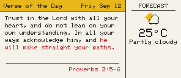
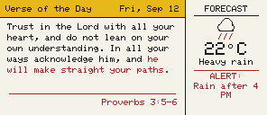

# CHROMAWOTD — 4-colour ePaper daily scripture & glanceable display

An ambient, low-power ePaper information display showing daily scripture, local weather,
and glanceable colour-coded alerts on a 2.9" quadruple-colour (black, white, red, yellow)
ePaper panel. Built upon the architectural and hardware lessons of the sibling
[eClock](../eClock) project.

---

## Technical Reality: Why Not a Minute-by-Minute Clock?

> [!IMPORTANT]
> **No partial refresh on 4-colour ePaper panels.**  
> The 2.9" BWRY display panel (JD79661 controller) **does not support partial refresh**
> (`USE_PARTIAL_EPAPER` in Seeed GFX only applies to monochrome panels). Every screen update
> executes a full **~25-second multi-pass physical pigment sweep** with noticeable flickering.
> 
> Refreshing every minute would destroy the display's lifespan, consume excessive power, and
> present an annoying visual distraction.
> 
> **Architectural Decision:** CHROMAWOTD is purposefully engineered as an **infrequent,
> glanceable ambient display** that refreshes 2–4 times per day (e.g., morning wake, noon update,
> evening forecast, night rest). Between refresh intervals, the ESP32-S3 enters deep sleep.

---

## Visual Concept & Rendered Outputs

The layout engine generates pixel-accurate renders for both portrait (128×296) and landscape
(296×128) orientations. The renders below are produced directly by the native host test
harness (`firmware/test/`):

| Portrait (Normal) | Portrait (Weather Alert) |
| :---: | :---: |
|  |  |

| Landscape (Normal) | Landscape (Weather Alert) |
| :---: | :---: |
|  |  |


---

## Semantic Colour Hierarchy

Colour on an ambient ePaper display must carry unambiguous meaning rather than arbitrary decoration:

| Pigment | Role | Usage |
| :--- | :--- | :--- |
| **White** | Canvas | Clean matte background. |
| **Black** | Typography & Structure | Primary scripture text, temperature digits, condition labels, borders. |
| **Yellow** | Orientation & Warmth | Header title bands, date badge, sun graphic rays and accents. |
| **Red** | Attention & Urgency | Highlighted scripture phrases, biblical citations, rain indicators, severe weather alerts. |

---

## Hardware Specifications

| Component | Part / Specification | Notes |
| :--- | :--- | :--- |
| **Display Panel** | Seeed 2.9" Quadruple Color ePaper (BWRY) | 128×296 pixels, JD79661 controller, 24-pin FPC, SPI, 3.3 V (SKU: `104990855`) |
| **Driver Board** | Seeed Studio XIAO ePaper Display Board EE05 | Integrated boost circuit, FPC connector, button, JST battery connector |
| **Microcontroller** | Seeed Studio XIAO ESP32-S3 (or S3 Plus) | Xtensa dual-core 240 MHz, 8 MB Flash, integrated 2.4 GHz Wi-Fi & BLE |
| **Power Supply** | USB-C or rechargeable LiPo battery via EE05 | USB-powered during development; target battery operation with deep sleep |

### Verified EE05 Pin Mapping

The EE05 board drives the panel via direct ESP32-S3 GPIOs (configured automatically in Seeed GFX via `BOARD_SCREEN_COMBO 512` and `USE_XIAO_EPAPER_DISPLAY_BOARD_EE05`):

| Signal | ESP32-S3 GPIO | XIAO Pin Alias | Function |
| :--- | :--- | :--- | :--- |
| **SCLK** | GPIO 7 | D8 | SPI Serial Clock |
| **MOSI** | GPIO 9 | D10 | SPI Data Out |
| **CS** | GPIO 44 | D7 | Display Chip Select |
| **DC** | GPIO 10 | D16 | Data / Command Control (bottom pad) |
| **BUSY** | GPIO 4 | D3 | Panel Busy Signal |
| **RST** | GPIO 38 | D11 | Hardware Reset (bottom pad) |
| **ENABLE** | GPIO 43 | D6 | Power Rail Enable |

---

## Software Architecture

### 1. Pure View Structs
Layout rendering is completely decoupled from data retrieval. All screen content is passed by value using pure data structures:

```cpp
struct VerseData {
    const char* date;
    const char* verse;
    const char* highlight;   // Phrase rendered in red (or nullptr)
    const char* reference;   // Citation rendered in red
};

struct WeatherData {
    float temp;
    const char* condition;
    const char* alert;       // Alert banner rendered in red (or nullptr)
    int icon;                // 0=Sun, 1=Cloud, 2=Rain, 3=Partly Cloudy
};
```

### 2. Dual-Target Layout Engine (`verse_display`)
The rendering code in `firmware/src/verse_display.cpp` targets both hardware and host:
* **Target Hardware (`#ifndef CHROMAWOTD_HOST`)**: Routes drawing calls directly to Seeed GFX (`epaper`), translating semantic colour constants (`CC_WHITE`, `CC_BLACK`, `CC_RED`, `CC_YELLOW`) to Seeed GFX display values.
* **Host Harness (`#ifdef CHROMAWOTD_HOST`)**: Routes drawing calls to `CcCanvas`, simulating panel pigments in an RGBA buffer with a vendored 5×7 font and writing PNG screenshots via `stb_image_write`.

### 3. Hardware Buttons & Dual Content Modes
The device supports on-demand interaction and wake-from-deep-sleep via two physical buttons:
* **Mode Switch Button**: Cycles visual presentation themes (Standard Light vs Inverted/Dark, Portrait vs Landscape orientation).
* **Refresh & Content Toggle Button**: Wakes the device to immediately refresh local weather and toggle between:
  1. **Verse of the Day (Word of God)**: Daily scripture reading with highlighted key phrase and biblical citation.
  2. **Word of the Day (Vocabulary)**: Curated vocabulary word, pronunciation guide, part of speech, definition, and usage sentence.

The active mode and last shown content type are persisted in non-volatile storage (`Preferences` / NVS) across deep sleep intervals.


---

## Repository Structure

```
CHROMAWOTD/
├── .codegraph/                  CodeGraph symbol database and indices
├── docs/
│   ├── PROJECT_PLAN.md          Phased implementation plan and milestones
│   ├── STATUS.md                Current project phase, completed tasks, and next steps
│   ├── lessons/
│   │   └── LESSONS_LEARNT.md    Hard-won findings, hardware quirks, and solutions
│   └── screenshots/             Exported PNG screenshots of layout renders
├── firmware/
│   ├── platformio.ini           PlatformIO build configuration for XIAO ESP32-S3
│   ├── src/
│   │   ├── main.cpp             Firmware entry point, setup, and display loop
│   │   ├── driver.h             Seeed GFX board & screen combo definitions
│   │   ├── verse_display.h      Layout engine public interface and data structures
│   │   └── verse_display.cpp    Layout rendering implementation (dual-target)
│   └── test/
│       ├── CMakeLists.txt       CMake configuration for native desktop tests
│       ├── harness/             Mock canvas, font engine, and drawing primitives
│       ├── tests/               GoogleTest suites for portrait, landscape, and alerts
│       └── output/              Generated PNG screenshots from ctest
└── tools/
    └── preview/                 HTML/CSS visual template for design prototyping
```

---

## Building and Running

### Host Test Harness & Image Previews

The host test suite compiles natively on Windows (MinGW GCC + Ninja) and outputs PNG renders without requiring physical hardware:

```powershell
# 1. Configure CMake build directory
cmake -S firmware/test -B firmware/test/build -G Ninja

# 2. Build the test executables
cmake --build firmware/test/build

# 3. Execute tests and generate PNGs
ctest --test-dir firmware/test/build --output-on-failure
```

Generated images will appear in `firmware/test/output/`.

### Firmware Build & Flashing

Firmware is built and flashed using PlatformIO:

```powershell
# In firmware/
cd firmware

# Build firmware for XIAO ESP32-S3
pio run -e s3

# Flash over USB CDC serial
pio run -e s3 -t upload

# Open serial monitor
pio device monitor -b 115200
```

---

## CodeGraph Navigation

This repository is indexed by **CodeGraph** (`.codegraph/`). To explore symbols, trace call graphs, or analyze blast radius with minimal token usage:

* **CLI**: Run `codegraph explore "<symbol or question>"` in the terminal.
* **MCP Tool**: Call `codegraph_explore` with `projectPath: "C:/Users/jptra/Projects/CHROMAWOTD"`.

---

## Key Lessons & Hardware Rules

1. **Exact-Power Display Sequencing**: On JD79661 panels, drawing must be completely staged before issuing `update()`. Powering down the panel while busy will cause panel latch-up.
2. **Serial DFU Flashing**: UF2 drag-and-drop is prone to timing failures on Windows USB hosts; use native USB CDC flashing via `esptool.py` (`pio run -t upload`).
3. **Flat Library Includes in PlatformIO**: Seeed_GFX root `TFT_eSPI.cpp` includes subfolder source files internally. Secondary translation units must include only `TFT_eSPI.h` to avoid duplicate class definitions.
4. **Pure View Decoupling**: Isolate rendering math from network/NTP state by passing pure data structs by value.

