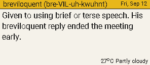

# ChromaWOTD — 4-colour ePaper verse, word & weather display

An ambient, low-power ePaper information display showing a daily scripture verse or a
vocabulary word depending on the time of day, local weather, and glanceable colour-coded
alerts on a 2.9" quadruple-colour (black, white, red, yellow) ePaper panel. It refreshes a few
times a day at scheduled slots (or on a button press) and deep-sleeps in between. Built upon
the architectural and hardware lessons of the sibling eClock project.

> [!TIP]
> **Just want to build and run one?** Start with the
> [**User Guide**](docs/USER_GUIDE.md) — hardware list, flashing a release image, the
> first-time setup wizard, the buttons and troubleshooting. This README is the
> developer-facing overview.

---

## Technical Reality: Why Not a Minute-by-Minute Clock?

> [!IMPORTANT]
> **No partial refresh on 4-colour ePaper panels.**
> The 2.9" BWRY display panel (JD79661 controller) **does not support partial refresh**
> (`USE_PARTIAL_EPAPER` in Seeed GFX only applies to monochrome panels). Every screen update
> executes a full **~25-second multi-pass physical pigment sweep** with noticeable flickering.
>
> Refreshing every minute would destroy the display's lifespan, consume excessive power, and
> present an annoying visual distraction.
>
> **Architectural Decision:** ChromaWOTD is purposefully engineered as an **infrequent,
> glanceable ambient display** that refreshes 2–4 times per day (e.g., morning wake, noon update,
> evening forecast, night rest). Between refresh intervals, the ESP32-S3 enters deep sleep.

---

## Visual Concept & Rendered Outputs

The device has a **single presentation: landscape (296×128) in the light theme**. The verse owns
the panel: a yellow band identifies *what* you are reading (the citation, or the word with its
respelling) with the date at the right, the text auto-sizes through a 10pt-down-to-5.5pt ladder,
and a footer row carries status/warnings on the left and the weather as text on the right.

| Verse of the Day | Word of the Day | With a severe-weather warning |
| :---: | :---: | :---: |
|  |  |  |

> [!IMPORTANT]
> These are rendered on the **device font path** — what the panel actually draws. Do not confuse
> them with the PNGs at the top level of `docs/images/`: those are the **regression ledger**,
> byte-compared on every `verify_all.py` run, and are rendered from the default host build where
> the proportional font is compiled out, so they show the 5×7 fallback font. The ledger proves the
> layout did not move; it is not a picture of the product.

Content that does not fit is truncated **visibly** with an inline ellipsis instead of being
dropped silently — and an over-long status warning is truncated the same way.

How the display arrived here — every era, with the render it was decided from, and what it cost —
is in [`docs/UI_HISTORY.md`](docs/UI_HISTORY.md). The portrait and dark/inverted variants that
predate the single presentation are kept under [`docs/images/history/`](docs/images/history/);
they are no longer produced.


---

## Semantic Colour Hierarchy

Colour on an ambient ePaper display must carry unambiguous meaning rather than arbitrary decoration:

| Pigment | Role | Usage |
| :--- | :--- | :--- |
| **White** | Canvas | Clean matte background. |
| **Black** | Typography & Structure | Primary scripture text, temperature digits, condition labels, borders. |
| **Yellow** | Orientation & Warmth | Header title bands, date badge, sun graphic rays and accents. |
| **Red** | Attention & Urgency | Highlighted scripture phrases, biblical citations, rain indicators, severe weather alerts. |

---

## Hardware Specifications

| Component | Part / Specification | Notes |
| :--- | :--- | :--- |
| **Display Panel** | Seeed 2.9" Quadruple Color ePaper (BWRY) | 128×296 pixels, JD79661 panel IC (Seeed GFX drives it through its JD79667 code path — `BOARD_SCREEN_COMBO 512`), 24-pin FPC, SPI, 3.3 V (SKU: `104990855`) |
| **Driver Board** | Seeed Studio XIAO ePaper Display Board EE05 | Integrated boost circuit, FPC connector, button, JST battery connector |
| **Microcontroller** | Seeed Studio XIAO ESP32-S3 (or S3 Plus) | Xtensa dual-core 240 MHz, 8 MB Flash, integrated 2.4 GHz Wi-Fi & BLE |
| **Power Supply** | USB-C or rechargeable LiPo battery via EE05 | USB-powered during development; target battery operation with deep sleep |

### Verified EE05 Pin Mapping

The EE05 board drives the panel via direct ESP32-S3 GPIOs (configured automatically in Seeed GFX via `BOARD_SCREEN_COMBO 512` and `USE_XIAO_EPAPER_DISPLAY_BOARD_EE05`):

| Signal | ESP32-S3 GPIO | XIAO Pin Alias | Function |
| :--- | :--- | :--- | :--- |
| **SCLK** | GPIO 7 | D8 | SPI Serial Clock |
| **MOSI** | GPIO 9 | D10 | SPI Data Out |
| **CS** | GPIO 44 | D7 | Display Chip Select |
| **DC** | GPIO 10 | D16 | Data / Command Control (bottom pad) |
| **BUSY** | GPIO 4 | D3 | Panel Busy Signal |
| **RST** | GPIO 38 | D11 | Hardware Reset (bottom pad) |
| **ENABLE** | GPIO 43 | D6 | Power Rail Enable |
| **BUTTON1** | GPIO 2 | D1 | User button, active-low (wakes from deep sleep) |
| **BUTTON2** | GPIO 3 | D2 | User button, active-low (wakes from deep sleep) |
| **BUTTON3** | GPIO 8 | D9 | User button, active-low (wakes from deep sleep) |
| **BAT_ADC** | GPIO 1 | D0 | Battery-sense divider input (ADC) — *not* a button |

The three button pins are the ones armed for `ext1` deep-sleep wake; `BAT_ADC` is available for
the deferred battery-monitoring work.

---

## Software Architecture

### 1. Pure View Structs
Layout rendering is completely decoupled from data retrieval. All screen content is passed by value using pure data structures:

```cpp
struct VerseData {
    const char* date;
    const char* verse;
    const char* highlight;   // Phrase rendered in red (or nullptr)
    const char* reference;   // Citation rendered in red
};

struct WeatherData {
    float temp;
    const char* condition;
    const char* alert;       // Alert banner rendered in red (or nullptr)
};
```

### 2. Dual-Target Layout Engine (`verse_display`)
The rendering code in `firmware/src/verse_display.cpp` targets both hardware and host:
* **Target Hardware (`#ifndef CHROMAWOTD_HOST`)**: Routes drawing calls directly to Seeed GFX (`epaper`), translating semantic colour constants (`CC_WHITE`, `CC_BLACK`, `CC_RED`, `CC_YELLOW`) to Seeed GFX display values.
* **Host Harness (`#ifdef CHROMAWOTD_HOST`)**: Routes drawing calls to `CcCanvas`, simulating panel pigments in an RGBA buffer with a vendored 5×7 font and writing PNG screenshots via `stb_image_write`.

Two rules are enforced in *shared* code so hardware and host can never disagree:

* **UTF-8 is normalised before drawing.** `TFT_eSPI`'s built-in font is ASCII/CP437, so every draw path funnels text through `cc_utf8ToAscii()`, which maps the glyphs real API text contains — `°` (drawn as a vector circle), curly quotes, en/em dashes, non-breaking spaces, ellipsis, `⚠` — onto single ASCII bytes and collapses anything unknown to one `?` per *glyph* (not per byte). Width measurement counts glyphs with the same decoder, so measured width always equals drawn width.
* **Truncation is never silent.** Each text block computes how many lines the greedy wrapper needs versus how many fit (`cc_wrappedLineCount` / `cc_lineCapacity`). If content will be cut, the final line's width budget is reduced (`cc_lineBudget`) so an ellipsis marker fits inline, and `drawOverflowMarker()` appends `...` (degrading to `..`/`.` only in very narrow columns). The footer's status warning uses the same rule via `cc_fitText()`. Verse text can therefore never spill into the footer row or run past the panel margin.

### 3. Hardware Buttons, Deep-Sleep Wake & Time-Based Content

The EE05 exposes **three** user buttons. All are **active-low** and RTC-capable, so a press
wakes the device from deep sleep through one shared `ext1` mask and runs exactly the same
Sync → Render → Sleep cycle as a scheduled wake (`wake_cause == ESP_SLEEP_WAKEUP_EXT1`).
Verified on hardware.

| Button | XIAO pin | GPIO | Polarity |
| :--- | :--- | :--- | :--- |
| BUTTON1 | D1 | GPIO 2 | active-low |
| BUTTON2 | D2 | GPIO 3 | active-low |
| BUTTON3 | D9 | GPIO 8 | active-low |

The pin map was **probed on the physical board** (`pio run -e probe`), not derived from the
schematic: the schematic reading put BUTTON3 on D4, which is actually `I2C_SDA`. Arming that
non-button pad for wake caused a deep-sleep wake storm — see `LESSONS_LEARNT.md` §34.

**Content is selected by local time; a button HOLD overrides it for one refresh:**

| Window | Content | Source |
| :--- | :--- | :--- |
| 00:00–16:29 | **Verse of the Day** | BibleGateway VOTD (`docs/research/SCRIPTURE_APIS.md`) |
| 16:30–23:59 | **Word of the Day** | A.Word.A.Day (`docs/research/WORD_APIS.md`) — the window opens at 16:30, which clears the source's publish instant (00:01 US Eastern = 14:01 AEST / **16:01 AEDT with US standard time**, the worst case) by 29 minutes in every month. The 06:00 and 12:30 refreshes are therefore verses. The page's own edition date is still checked against the local date, so a word that is not yet today's shows the verse rather than yesterday's word |

The header title follows the mode, and the policy lives in pure, unit-tested
`sched/content_policy.{h,cpp}`. If NTP fails, the device falls back to the verse rather than
showing the wrong content.

The Word-of-the-Day presentation puts the definition plus the usage example in the body, with
the **respelling pronunciation** beside the headword in the header band. The respelling is never
dropped to make room — it shrinks (7 → 5pt) and only truncates visibly as a last resort. The body
auto-sizes to the panel and marks any cut with `...`; the example is a whole paragraph, so it is
kept intact in the parser (1 KB field) and the *renderer* decides how much of it the panel holds.

> **Not yet implemented** (tracked in `docs/PROJECT_PLAN.md`): cached last-good content (show the
> previous verse/word with an "as of" note instead of the unavailable screen), and the refresh
> lockout during the ~25 s panel sweep. Credentials and device state ARE persisted in NVS — see
> `docs/STATUS.md` (Phase 5).

### 4. Network Layer & Data Sources
`firmware/src/net/` splits the network path so parsing and mapping are testable on the host:

* **`net.cpp`** — shared logic (WMO code → condition text/alert, JSON and A.Word.A.Day
  HTML parsing), plus a host fetch backend that shells out to `curl`.
* **`net_impl_esp32.{h,cpp}`** — the device backend: Wi-Fi, `HTTPClient`, `ArduinoJson`, and
  the pinned root CAs.
* **TLS validation is mandatory.** `setInsecure()` is never called; each host is validated
  against its pinned root/intermediate (Amazon Root CA 1 for BibleGateway, Let's Encrypt YR2
  for Open-Meteo, Let's Encrypt YE1 for Wordsmith).
* **The sync phase runs on a dedicated FreeRTOS task with a 16 KB stack** — the first TLS
  handshake needs more stack than the default Arduino `loopTask` provides (see the STACK NOTE
  in `main.cpp`).

| Weather | `api.open-meteo.com/v1/forecast` | `forecast_days=2`; daytime (< 18:00) shows today's expected maximum + condition in the footer row; evening (18:00–23:59) shows tomorrow's expected maximum + condition with a red **TOMORROW** marker (without it the number is indistinguishable from today's) |
| Verse | `biblegateway.com/votd/get/?format=json&version=NIV` | `docs/research/SCRIPTURE_APIS.md` |
| Word | `wordsmith.org/words/today.html` | A.Word.A.Day respelling pronunciation; `docs/research/WORD_APIS.md` |

Any failure degrades to bundled fallback content behind a red `OFFLINE:` banner — the
substitution is never silent.

### 5. Wake Schedule
`sched/wake_schedule.{h,cpp}` computes the strictly-forward next slot from a local `struct tm`
(slots exactly **06:00 / 12:30 / 18:00**), with a 60 s floor that makes a wake loop impossible
and a 1 h fallback when the clock is not trustworthy. `setup()` then arms an RTC timer for
that interval **and** the `ext1` button mask, and calls `esp_deep_sleep_start()`. Between
refreshes the ESP32-S3 is fully asleep — its native USB powers down, so the serial port
disappears (expected, not a crash; see `LESSONS_LEARNT.md` §32).


---

## Repository Structure

```
ChromaWOTD/
├── .codegraph/                  CodeGraph symbol database (index files gitignored)
├── docs/
│   ├── ARCHITECTURE.md          Data flow, refresh/power sequence, security, presentation
│   ├── CODE_REVIEW.md           Phases 2–5 review, with the fix-status table
│   ├── PROJECT_PLAN.md          Phased implementation plan and milestones
│   ├── STATUS.md                Current project phase, completed tasks, and next steps
│   ├── REVIEW.md                Critical code & project review (security, design, hygiene)
│   ├── UI_HISTORY.md            How the display has changed, era by era, with the renders
│   ├── USER_GUIDE.md            End-user guide: flash a release, set up, use it
│   ├── hardware/datasheets/     Vendor PDFs (gitignored) + README with download links
│   ├── images/                  Regression ledger PNGs (byte-compared) + history/ archive
│   ├── lessons/
│   │   └── LESSONS_LEARNT.md    Hard-won findings, hardware quirks, and solutions
│   └── research/
│       ├── SCRIPTURE_APIS.md    Verse-of-the-Day endpoint research & fallbacks
│       ├── WEATHER_APIS.md      Open-Meteo vs BoM comparison & local config
│       └── WORD_APIS.md         Word-of-the-Day source research (A.Word.A.Day)
├── firmware/
│   ├── platformio.ini           PlatformIO build configuration for XIAO ESP32-S3
│   ├── include/
│   │   └── chroma_version.h     Firmware version string
│   ├── src/
│   │   ├── main.cpp             Firmware entry point, setup, and display loop
│   │   ├── verse_display.h      Layout engine public interface and data structures
│   │   ├── verse_display.cpp    Layout view functions + font metrics (dual-target)
│   │   ├── text/
│   │   │   ├── glyphs.{h,cpp}   Single UTF-8 → ASCII decoder (cc_utf8ToAscii*)
│   │   │   └── wrap.{h,cpp}     Line-capacity / width-budget math
│   │   ├── draw/
│   │   │   ├── target.h         DisplayTarget interface
│   │   │   ├── target_canvas.cpp  Host backend (mock canvas + PNG)
│   │   │   ├── target_seeed.cpp   Device backend (Seeed GFX)
│   │   │   ├── font_types.h     GFXglyph/GFXfont types (host shim / device gfxfont.h)
│   │   ├── net/
│   │   │   ├── net.{h,cpp}      Shared parse/mapping + host (curl) fetch backend
│   │   │   ├── net_impl_esp32.{h,cpp}  Device backend: Wi-Fi, TLS, ArduinoJson
│   │   │   └── net_host_curl.cpp       Host curl hook
│   │   ├── sched/
│   │   │   ├── wake_schedule.{h,cpp}   Next wake slot (06:00/12:30/18:00) — pure
│   │   │   └── content_policy.{h,cpp}  Verse/Word by hour + tomorrow-forecast window
│   │   └── fonts/               Mono-hinted Roboto GFX fonts (5/5.5/6/10pt)
│   └── test/
│       ├── CMakeLists.txt       CMake configuration for native desktop tests
│       ├── harness/             Mock canvas, font engine, and drawing primitives
│       ├── tests/               GoogleTest suites: landscape, alert, overflow, text, net, sched
│       ├── tools/               layout_render.cpp — CLI preview renderer (--word-live / --word-file)
│       └── output/              Generated PNG renders from ctest (gitignored)
└── tools/
    ├── verify_all.py            One-command check: build + tests + render ledger + alignment
    ├── measure_layout.py        Measure/assert the render's alignment invariants
    ├── bench_watch.py           Non-invasive wake/sleep watcher (port presence / log capture)
    ├── render_preview.py        Render any verse/weather fixture without flashing
    ├── esp32s3_reset.py         Release the USB-Serial/JTAG download-mode latch
    ├── regenerate_screenshots.py  Build tests → ctest → sync PNGs into docs/images/
    └── preview/                 HTML/CSS design mockup + shared JSON fixture
```

---

## Security & Compliance

> [!IMPORTANT]
> This device handles credentials (Wi-Fi, API keys) and displays content from
> untrusted sources (scripture, weather). The full security model — TLS
> certificate validation, credential handling, remote-data boundaries, and OTA
> posture — is documented in [`docs/ARCHITECTURE.md`](docs/ARCHITECTURE.md#security-model).
> Key rules, in brief:
>
> - **TLS validation is mandatory.** Never call `WiFiClientSecure::setInsecure()`;
>   ship root CAs and call `setCACert()` before every HTTPS request (S1).
> - **Credentials live only on the device.** They are entered over the first-boot
>   captive portal and stored in NVS; they are never echoed to serial (S3), and there
>   is no compiled-in credential path at all — nothing is read from a source file, so
>   a locally-built image cannot contain them. The firmware prints `ssid=(set)` or
>   `(empty)`, never the value.
>   Resolution order is NVS → built-in defaults, so only the portal configures a
>   device. A device with no stored config boots to the setup screen.
> - **Remote text is untrusted input** — the renderer's fixed buffers are the
>   boundary; `snprintf`/bounded-copy only, never `sprintf` (S4).
> - **Committing a secret is blocked, not just discouraged.** gitleaks runs on every
>   commit via a pre-commit hook and again over full history in CI. See below.

### Secret scanning (set this up after cloning)

Credentials are gitignored, but a guard that is never installed cannot guard. Install the hooks
once per clone:

```powershell
pip install pre-commit
pre-commit install
pre-commit run --all-files    # optional: scan the whole tree now
```

Two layers, matching the sibling eClock project:

| Layer | Scope | Config |
| :--- | :--- | :--- |
| `pre-commit` hook (local) | staged content on every commit | `.pre-commit-config.yaml` → gitleaks + hygiene hooks |
| CI job `secrets` (remote) | **all history** on every push/PR | `.github/workflows/ci.yml` → `gitleaks detect --exit-code 1` |

gitleaks' allowlist (`.gitleaks.toml`) covers only vendored and generated content — `.pio/`, CMake
build trees, `firmware/test/output/`, `firmware/test/third_party/` and the vendored GFX font tables.
Authored source (`firmware/src`, `tools/`, `docs/`) is deliberately **not** allowlisted, so a real
secret in project code still fails the scan.

Note the first commit after installing the hooks can fail while `end-of-file-fixer` rewrites newly
added files; `git add -A && git commit` again and it passes.

## Building and Running

> A critical review of the code and project structure lives in
> [`docs/REVIEW.md`](docs/REVIEW.md) — it catalogues security, design and hygiene
> findings with a recommended priority order.

### Verify everything in one command

```powershell
python tools/verify_all.py              # firmware build + host tests + render ledger
python tools/verify_all.py --clean      # full firmware rebuild first
python tools/verify_all.py --skip-firmware   # fast host-only loop
python tools/verify_all.py --fix        # resync docs/images after an intentional layout change
```

Exit code is non-zero on any failure. Six stages run in order: firmware build, host tests,
the device-font host tests, the render ledger, layout alignment, and the Python lint over `tools/`
(the same `black --check` + `flake8` checks CI runs — that stage is where a green local run used to
still turn a push red). The render ledger md5-compares
`firmware/test/output/*.png` against `docs/images/*.png` and reports missing, stale or
orphan files, so the archived renders can never silently drift from the code. The alignment
stage (`tools/measure_layout.py --check`) measures the rendered PNGs and asserts the panel's
geometry invariants — caption level with the date, rule and caption on the body text's
margins — so an alignment regression fails the check rather than needing to be spotted by eye.

### Measure a render's alignment

```powershell
python tools/measure_layout.py                 # report the golden render's geometry
python tools/measure_layout.py --check --all   # assert every layout render; non-zero on failure
python tools/measure_layout.py firmware/test/output/previews/foo.png
```

Reports the header ink rows, the caption rule's extent, the body text's left margin and the
left caption's ink position, then passes/fails each invariant. Useful after any layout tweak:
alignment must be judged on **ink**, not on the drawing coordinate (a glyph can carry a side
bearing — see `LESSONS_LEARNT.md` §36). Skips cleanly if Pillow is not installed.

### Watch the device on the bench

```powershell
python tools/bench_watch.py --presence --seconds 90    # wake/sleep trace, no reset
python tools/bench_watch.py --capture --seconds 150    # wait for wake, then read the boot log
```

**Do not use `pio device monitor` to observe wake/sleep behaviour:** attaching asserts DTR/RTS
and *resets* the ESP32-S3, which manufactures a reboot cycle that looks exactly like a
firmware wake storm (`LESSONS_LEARNT.md` §34). `--presence` never opens the port (the port
vanishing is how deep sleep is detected), and `--capture` opens it with DTR/RTS deasserted.

### Preview any fixture without flashing

```powershell
# Bundled sample fixture, default output
python tools/render_preview.py --fixture

# Ad-hoc fixture: negative temperature + alert
python tools/render_preview.py --temp -2.5 --condition "Partly cloudy" \
    --alert "Rain likely after 4 PM" --verse "Trust in the Lord with all your heart." \
    --highlight "Lord" --reference "Proverbs 3:5-6" --open

# Word of the Day: today's page live, or a SAVED page with the same parser + body
# composer the device uses (this is how a PAST day's panel is reproduced after the
# source has moved on)
python tools/render_preview.py --word-live
python tools/render_preview.py --word-file "$env:TEMP\wordsmith_today.html" --date-ymd 2026-09-21

# Hand-made Word-of-the-Day look, including the respelling in the header band
python tools/render_preview.py --verse "noun: A feeling of doubt." --reference "misgiving" \
    --leftcap "(mis-GIV-ing)" --header "Word of the Day"

# The "no reading" state (a failed weather fetch), instead of a temperature
python tools/render_preview.py --fixture --no-weather
```

Renders land in `firmware/test/output/previews/` (gitignored, outside the ledger) and
use the same draw calls the device executes. The tool also prints whether the highlight
phrase was found, so a silently dropped red accent is obvious. Under the hood it drives
`layout_render`, built by the same CMake project.

**Which font are you looking at?** `render_preview.py` uses `firmware/test/build`, which is the
5×7 **fallback** path. For the font the panel actually ships, build the device path once and call
its binary directly:

```powershell
cmake -S firmware/test -B firmware/test/build-device -G Ninja -DCHROMAWOTD_DEVICE_FONTS=ON
cmake --build firmware/test/build-device --target layout_render
./firmware/test/build-device/layout_render.exe --word-file "$env:TEMP\wordsmith_today.html" `
    --date-ymd 2026-09-21 --out out.png
```

A preview of one path must never be compared with a render of the other: the proportional Roboto set
is what the device draws, and the 5×7 fallback has no descenders.

### Host Test Harness & Image Previews

The host test suite compiles natively on Windows (MinGW GCC + Ninja) and outputs PNG renders without requiring physical hardware:

```powershell
# 1. Configure CMake build directory
cmake -S firmware/test -B firmware/test/build -G Ninja

# 2. Build the test executables
cmake --build firmware/test/build

# 3. Execute tests and generate PNGs
ctest --test-dir firmware/test/build --output-on-failure
```

Generated images will appear in `firmware/test/output/`. GoogleTest is fetched from GitHub on first
configure; to build offline (or reuse an existing checkout) pass a local tree:
`cmake -S firmware/test -B firmware/test/build -DCHROMAWOTD_GTEST_DIR=<path-to-googletest>`.

The suites are:

| Suite | Covers |
| :--- | :--- |
| `test_layout_landscape` | Single-layout geometry: header band extent, no divider, the verse occupying the full width, the right margin |
| `test_layout_alert` | The footer row: a warning renders bottom-LEFT in red, the weather text bottom-RIGHT, neither spills, and an over-long warning is truncated with a visible marker |
| `test_layout_overflow` | Region invariants (nothing spills out of a block), overflow markers (per font family), temperature rounding, highlight matching, UTF-8 → ASCII normalisation |
| `test_verse_autosize` | The verse body auto-size ladder (Roboto 10/9/8/7/6/5.5/5pt) — compiled **with** `-DCHROMAWOTD_FONT_FREESANS=1` so the selection the panel makes is actually covered |
| `test_net` | WMO code → condition/alert mapping, JSON extraction, A.Word.A.Day HTML parsing (incl. printable-ASCII and newline-collapse guards), plus live-fetch smoke tests that skip when there is no network |
| `test_sched` | Next-wake slot math (midnight roll-over, slot boundaries, never 0) and the time-based content/forecast policy |

Fixtures used by the suites are mirrored in `tools/preview/sample_data.json`.

#### Testing the font path the device actually ships

The firmware builds with `-DCHROMAWOTD_FONT_FREESANS=1`, but the host targets compile the
fallback 5x7 path by default. The proportional glyph, degree, measurement and auto-size code the
panel executes therefore needs its own run:

```powershell
cmake -S firmware/test -B firmware/test/build-device -G Ninja -DCHROMAWOTD_DEVICE_FONTS=ON
cmake --build firmware/test/build-device
ctest --test-dir firmware/test/build-device --output-on-failure
```

`tools/verify_all.py` runs this as stage 3/6 automatically. Always use a **separate build
directory**: the layout tests write to fixed paths under `firmware/test/output/`, so a
device-font run overwrites the 5x7 renders the ledger compares against `docs/images/`.

To ask which body font a given text gets (the auto-size ladder picks by measured fit):

```powershell
python tools/font_size_probe.py --live                      # today's real content
python tools/font_size_probe.py --verse "Trust in the Lord with all your heart."
```

### Firmware Build & Flashing

Firmware is built and flashed using PlatformIO:

```powershell
# In firmware/
cd firmware

# Build firmware for XIAO ESP32-S3
pio run -e s3

# Flash over USB CDC serial
pio run -e s3 -t upload

# Button-pad diagnostic: identify the button pins/polarity on the bench
pio run -e probe -t upload
```

> [!IMPORTANT]
> **While the device is deep-asleep, its serial port does not exist.** The XIAO ESP32-S3's
> native USB Serial/JTAG lives in the digital power domain, so `COM13` disappears the moment
> `esp_deep_sleep_start()` runs.
>
> **Normal re-flash: just retry the upload.** This board uses the native USB Serial/JTAG
> peripheral, which can put the ESP32-S3 into download mode *by itself* — no BOOT/RESET
> button sequence is involved. In practice, double-tapping RESET (or unplug/replug USB)
> re-enumerates the port and a plain upload then succeeds:
>
> ```powershell
> python tools/flash_when_awake.py --seconds 420   # polls for the port, uploads on sight
> ```
>
> **Recovery, only if that fails:** the ROM-download-mode button sequence — **hold BOOT, tap
> RESET, release BOOT**. This matters when the chip is wedged or the port will not enumerate at
> all (e.g. stuck in download mode from a bad DTR/RTS reset, see `LESSONS_LEARNT.md` §9). It is
> a last resort, not the routine path. Both buttons live on the XIAO module beside the USB-C
> connector and are tiny; the three user buttons on the EE05 carrier are unrelated.

Useful build flags (`firmware/platformio.ini`): `-DCHROMAWOTD_BUTTON_WAKE=1` enables the
`ext1` button wake; `-DCHROMAWOTD_DEEP_SLEEP` controls sleeping; `-DCHROMAWOTD_WAKE_TEST_SEC=N`
forces a short sleep for bench observation; `-DCHROMAWOTD_HOSTNAME` overrides the DHCP
hostname (default `ChromaWOTD`), and `-DCHROMAWOTD_MDNS=1` additionally answers to
`ChromaWOTD.local` (~24 KB flash).

### First-time setup (no toolchain needed)

A device with no stored configuration boots into a **setup portal** instead of showing
fallback content:

1. The ePaper shows an AP name (`ChromaWOTD-XXXXXX`) and a **per-boot random password**.
2. Join that network from a phone or laptop, using the password on the panel.
3. The captive-portal sheet appears (or browse to `http://192.168.4.1`) and asks for
   your Wi-Fi network/password, timezone and coordinates.
4. Save — the device stores the values in its own flash (NVS) and restarts into normal
   operation.

**Factory reset:** hold any of the three buttons for **10 seconds** while the device
wakes; it erases the stored configuration and returns to the portal. Re-flashing the
merged image (`write_flash 0x0`) has the same effect, since that image includes the
NVS region.

### Settings precedence

```
NVS (set over the portal)  >  built-in defaults
```

Credentials exist **only** in NVS, written by the setup portal — there is no
compile-time credential path, so nothing you flash can leak your network details. The
built-in defaults below NVS cover location/timezone so a device still behaves
coherently, but a device with no stored config boots to the setup screen.

This ordering is also what makes updates safe: flashing the **app-only** image writes
from `0x10000` and leaves NVS at `0x9000` untouched, so your settings survive an
update, while the merged image at `0x0` gives you a clean, factory-fresh device.

### Releases

Releases are cut by pushing a `v*` tag; the tag drives everything.

```bash
python tools/verify_all.py --clean     # confirm ALL GREEN first
# bump CHROMAWOTD_VERSION in firmware/include/chroma_version.h, commit
git tag -a v0.1.0 -m "ChromaWOTD v0.1.0"
git push origin v0.1.0                 # <- triggers the Release workflow
gh release view v0.1.0                 # confirm the assets landed
```

The Release workflow builds from a clean checkout and attaches:

| Asset | Use |
| :--- | :--- |
| `ChromaWOTD-<tag>.bin` | **Merged flash image** (bootloader + partitions + `boot_app0` + app). Flash at `0x0` in one command. |
| `ChromaWOTD-<tag>-app.bin` | Application only (`0x10000`) for updating an already-flashed board. |
| `ChromaWOTD-<tag>.elf` | Unstripped, for debugging. |

Release notes are generated from the feat/fix commits since the previous `v*` tag and
**include the flash procedure**, so the Releases page is self-contained. For the
end-user walkthrough (hardware, flashing, the setup wizard, the button gestures), see
[`docs/USER_GUIDE.md`](docs/USER_GUIDE.md).

A released image contains no credentials, and cannot: there is no way to compile them
in. Flash it and the device comes up in its setup portal, where you enter your Wi-Fi
details — they are stored on the device and never leave it.

`tools/merge_firmware.py` still verifies what it packages: each image segment's
signature at its expected offset (a merge that silently omits `otadata` produces an
image that flashes fine then fails to boot), plus the app's presence.

### Flashing a released image (no toolchain required)

```bash
pip install esptool
esptool.py --chip esp32s3 --port <PORT> write_flash 0x0 ChromaWOTD-v0.1.0.bin
```

`<PORT>` is `COM13`-style on Windows, `/dev/ttyACM0` on Linux, `/dev/cu.usbmodem*` on macOS.
The merged image erases and rewrites the bootloader and partition table, so it works on a
blank board as well as an existing one.

---

## CodeGraph Navigation

This repository is indexed by **CodeGraph** (`.codegraph/`). To explore symbols, trace call graphs, or analyze blast radius with minimal token usage:

* **CLI**: Run `codegraph explore "<symbol or question>"` in the terminal.
* **MCP Tool**: Call `codegraph_explore` with `projectPath: "C:/Users/jptra/Projects/ChromaWOTD"`.

---

## Key Lessons & Hardware Rules

1. **Exact-Power Display Sequencing**: On JD79661 panels, drawing must be completely staged before issuing `update()`. Powering down the panel while busy will cause panel latch-up.
2. **Serial DFU Flashing**: UF2 drag-and-drop is prone to timing failures on Windows USB hosts; use native USB CDC flashing via `esptool.py` (`pio run -t upload`).
3. **Flat Library Includes in PlatformIO**: Seeed_GFX root `TFT_eSPI.cpp` includes subfolder source files internally, and PlatformIO compiles only that root directory, so `main.cpp` includes `TFT_eSPI.cpp` directly. There is no subfolder-exclusion option to configure — `lib_build_src_filter` is not a PlatformIO setting and is ignored with a warning.
4. **Pure View Decoupling**: Isolate rendering math from network/NTP state by passing pure data structs by value.
5. **No Silent Truncation**: Any content block that can overflow must mark the cut (`...`) rather than dropping words; region invariants in `test_layout_overflow` enforce that nothing leaves its block.
6. **Probe pin maps on the board; don't decode them from a schematic.** A `pdftotext -layout` read of the EE05 schematic scrambled the net-label-to-pin association and put BUTTON3 on D4 — which is `I2C_SDA`. Arming that non-button pad for `ext1` wake produced a deep-sleep wake storm. `pio run -e probe` prints every pad transition so the real map is established in one flash (`LESSONS_LEARNT.md` §33–34).
7. **Judge alignment on ink, not on the drawing coordinate.** A caption drawn at the same nominal x can still land 1 px off because of a glyph's side bearing; `tools/measure_layout.py` measures the rendered pixels and asserts the invariants (`LESSONS_LEARNT.md` §36).
8. **Never observe deep-sleep behaviour through `pio device monitor`** — attaching asserts DTR/RTS and resets the board, faking a wake storm. Use `tools/bench_watch.py --presence` (`LESSONS_LEARNT.md` §34).
