# ChromaWOTD — how the display has changed

The presentation is the product, so the record of how it got here is part of the design. This
file is the chronology: what each change was, why it was made, the render that was approved, and
the lesson it left behind — with the renders themselves inline, so the change is visible rather
than described. The images are the archived copies in
[`images/history/`](images/history/) — the couple of dozen that were actually *decided from*,
rather than every screenshot ever taken.

**How to read the images — and which font each one shows.** Two different builds produced the
renders in this file, and the difference matters when you are judging type:

- **The default host build (5×7 fallback).** The files in `images/` (the top level, not
  `history/`) are the regression ledger: byte-compared against `docs/images/` on every
  `verify_all.py` run, rendered from the default host build where the proportional font is
  compiled out. They therefore show the 5×7 fallback font, which is **not** what the panel looks
  like. The 2026-09-12 composition renders in `history/` are from that same default build —
  verified by eye: their `y` and `g` sit flat on the baseline, because 5×7 has no descenders.
- **The device-font build.** Everything from the afternoon font experiments onward
  (FreeSans → Roboto → the ladder, the portal screens, the 2026-09-19 verse-first redesign) is
  from the proportional path and shows what the panel actually draws — real descenders, variable
  advance. Those are the renders a typography decision should be made from.

That distinction has bitten this project more than once — see the last row of the table in §7.
Captions below name the font where it is known.

---

## 1. 2026-09-12 — five presentations, then one

Phase 1 shipped five layouts: portrait, portrait-inverted, landscape, landscape-inverted and
landscape-dark, with a theme/orientation dispatcher. They were collapsed to a **single light
landscape presentation** on the same day.

| portrait | landscape, inverted |
|---|---|
| 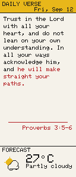 | 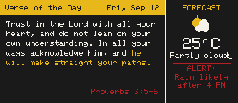 |

| landscape, dark | portrait, overflow (`...` marker) | portrait, alert |
|---|---|---|
| 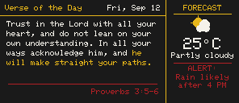 | 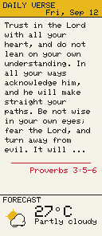 | 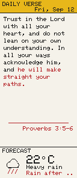 |

*(5×7 fallback build — the layout is the subject here, not the type.)*

- **Why:** the 4-colour panel has no partial refresh — every update is a full ~25 s pigment
  sweep — so a "switch mode/theme" button was never going to be a usable interaction. Five
  layouts also meant every geometry change had to be made in five places, and they had already
  drifted (the dispatcher could not even reach "dark portrait" — REVIEW D3).
- **Lesson:** removing options removed bugs. The collapse also deleted the cramped alert strip and
  most of the duplicated geometry constants.

## 2. 2026-09-12 — the font journey

Four attempts in one afternoon, each with a render:

| attempt | render | outcome |
|---|---|---|
| `font_convert.py` + FreeSans 8pt | 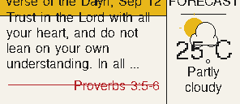 | **rejected** — crowded the weather column |
| FreeSans 6pt | 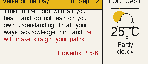 | fits the layout, but the baseline sat wrong |
| FreeSans 6pt, baseline corrected | 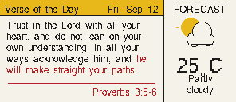 | the correction attempt |
| mono-hinted **Roboto 5.5pt** | 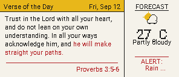 | **adopted** — Roboto read best of the mono-hinted candidates |

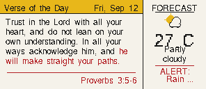

*FreeSans 6pt rendered against the exact fixture geometry rather than the nearest real verse —
the check that separated "the font is wrong" from "the fixture was wrong".*

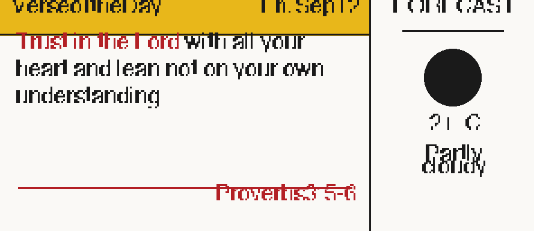

*The FreeSans experiment at roughly 3× magnification — how the glyph shapes were compared. The
weather glyph in that build rendered as a filled disc.*

The auto-size ladder, and the lengths that drove it:

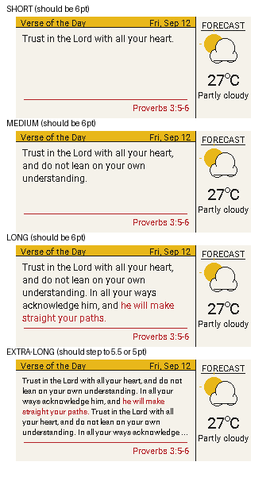

*Four verse lengths side by side (composite).*

| ladder boundary case | medium-length verse | a short verse, one candidate up |
|---|---|---|
| 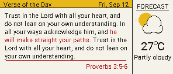 | 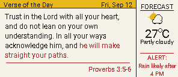 | 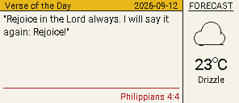 |

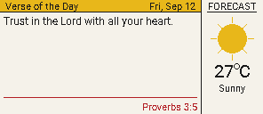

*Device-font build: a verse that **fits** gets no `...` marker — the known-negative case that makes
the overflow-marker detector trustworthy.*

- **Why a ladder rather than one size:** a fixed size is wrong for something whose length varies
  from eleven characters to three hundred.
- **Lesson:** §27 (why 5.5pt, mono-hinted) and §38 — the ladder silently collapsed at one point
  because every candidate was measured while the *previous* font was still active, making the
  line count font-independent. The per-candidate font assignment is load-bearing.

## 3. 2026-09-12 — the weather column's own UI

The right-hand column got a `FORECAST`/`TOMORROW` caption with an underline divider, and the icon
**grew to fill the freed space** when there was no alert:

| no alert — before | no alert — after |
|---|---|
| 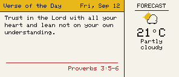 | 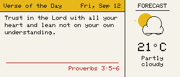 |

| rain — before | rain — after |
|---|---|
| 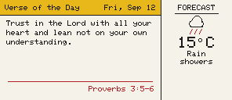 | 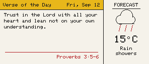 |

| alert — before | alert — after |
|---|---|
| 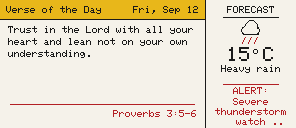 |  |

*(Those two files are byte-identical — md5 `75e177236c171482a7b0a2ba131f5c0e` — so the alert case
shows no change at all: the icon only reflowed when nothing else was pushing in from below. Kept
as a pair because that is what the capture showed, not because there is a difference to see.)*

| `FORECAST` caption | `TOMORROW` caption | caption alignment fixed |
|---|---|---|
| 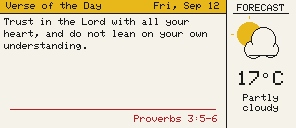 | 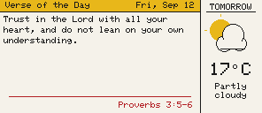 | 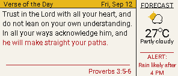 |

The four-state icon set was drawn and catalogued:

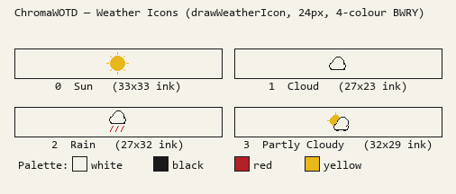

- **Known limitation, accepted at the time:** only WMO ≥ 80 draws the Rain glyph, so Drizzle and
  Rain 61–67 fall back to the plain Cloud (LESSONS §35) —
  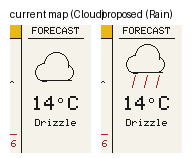
- **Retrospect:** this is the UI that §7 eventually removed. It was not wrong when it was built —
  it came out when the weather was treated as a co-equal half of the panel.

## 4. 2026-09-12 — Word of the Day arrives, and the caption line becomes dual

The bottom line went from "reference only" to a **dual caption**: the respelling pronunciation in
black at the left, the headword (or verse citation) in red at the right.

Two layouts were trialled before settling — the definition inline, versus the definition with the
caption treatment:

| variant A — definition inline | variant B — definition + caption |
|---|---|
| 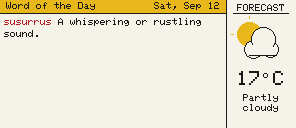 | 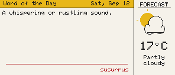 |

The settled treatment, and the cases around it:

| definition + example | evening (next-day forecast) | evening, live fetch |
|---|---|---|
| 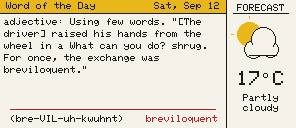 | 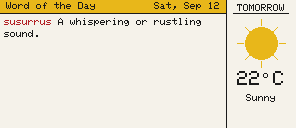 | 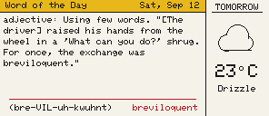 |

| definition + example, evening | captions aligned to the body margin |
|---|---|
| 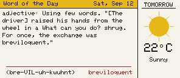 | 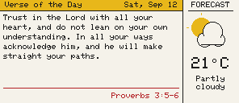 |

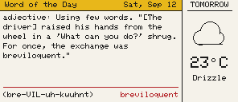

*The Word-of-the-Day case with the caption line aligned to the body margin — respelling left,
headword right.*

- **Lesson:** the caption line's margins were then aligned to the body text, which is the kind of
  detail that reads as sloppiness when it is 4 px out and is invisible when it is right. It is
  asserted by `tools/measure_layout.py --check`, not by eye.

## 5. 2026-09-12 → 13 — structure, and stopping the UI from lying

Two changes that were not cosmetic but changed what the panel *said*:

- **Module split** (REVIEW D1–D6): the decoder and wrap math into `text/`, the icon into `draw/`,
  the backend behind a `DisplayTarget` interface, enums for icons/theme, named layout constants.
  No visible change by design — that is what the render ledger exists to prove (§8).
- **No invented data** (`fix(content)`): a failed fetch used to render a canned verse and a
  defaulted **`0°C`** with full confidence. Now there is no bundled fallback at all — the body
  becomes an explicit "unavailable" screen and the weather carried the reason as a red
  `OFFLINE:` / `PARTIAL:` alert. **A device that looks like it works when it does not is worse
  than one that looks broken** (LESSONS §44).

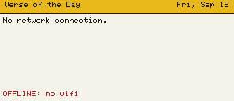

*The honest-failure screen, as the regression ledger renders it today: a stated reason, and no
number invented to fill the space.*

## 6. 2026-09-13 — the setup screen

The first-boot captive portal got its own UI: a Wi-Fi **QR code** so the network can be joined by
scanning, an 8-digit numeric AP password (numeric because it is read off a 4-colour panel by eye),
a left-aligned text block, and a **rejection screen** that repaints the panel with the reason when
a form submit fails validation.

| setup screen, QR code | password in the native 10pt font | rejected submission |
|---|---|---|
| 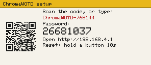 | 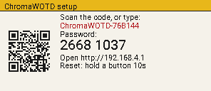 | 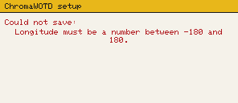 |

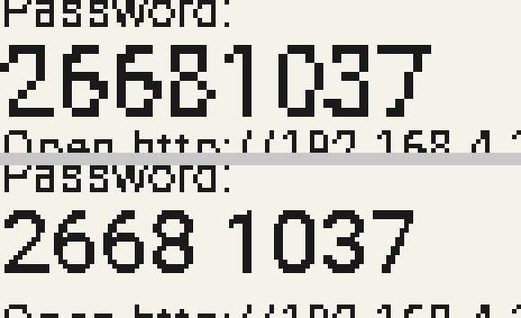

*The font decision behind the password line: native 10pt versus the scaled 5.5pt it replaced.*

## 7. 2026-09-19 — the verse-first redesign

The largest change since Phase 1, and the only one driven by a specific reader's need: the owner
reads this panel at 55 and said the text needed to be larger.

| before | after |
|---|---|
|  |  |

*The same job, before and after: a 70 px weather column and a 5.5pt body, versus the full panel
width and a body the ladder can take to 10pt.*

- **Removed:** the 70 px weather column (24% of the width), the `FORECAST`/`TOMORROW` caption, the
  vertical divider, the weather icon, and the mode title ("Verse of the Day" / "Word of the Day").
  The icon went further than the layout: the `WeatherIcon` enum, the WMO→icon mapping,
  `draw/weather_icon.*` and the sprite-sheet generator were deleted too, once it was clear
  nothing in the product drew them (LESSONS §61).
- **Header band = *what* you are reading:** the citation (`Proverbs 3:5-6`), or the word with its
  respelling, at 7pt — the line you actually glance at. The date sits right at the same size.
- **Body = the verse**, full panel width, auto-sized through a ladder now topping out at **10pt**.
- **Footer row = status/warnings bottom-left (red), weather as text bottom-right.**

| word of the day at 10pt | short verse at 10pt | warning in the footer |
|---|---|---|
| 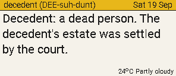 | 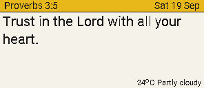 |  |

| word of the day, full width | alert, bottom-pinned, with its `...` marker |
|---|---|
|  | 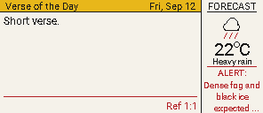 |

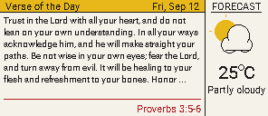

*The overflow marker on the device font — the case that the font-calibrated test was corrected
against (LESSONS §39).*

- **Lessons:** §53 (the redesign and the defects found implementing it), §54 (the date was ISO on
  the device while every render showed `Fri, Sep 12` — a *provenance* bug, not a formatting one),
  §55 (the 10pt ceiling and what it does not fix).

## 8. 2026-09-22 — three defects the panel reported, and none of them was the font

The owner read the panel and reported three things: **the same word of the day as yesterday**, **no
pronunciation**, and **an incomplete usage example with room to spare**. All three turned out to be
data-shaped — a drop rule, two caps, and a timezone — not typography.

| what the panel drew (before) | after |
|---|---|
| 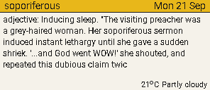 | 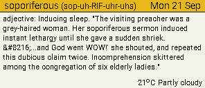 |
| `soporiferous` with the date and **no pronunciation**: the pair measured 212px against 208px of room at 7pt, and the old rule degraded by dropping the respelling. The body stops at "…this dubious claim twic" — mid-word, with no marker and ~1.5 lines free below | the respelling shrunk to 5.5pt so the pair fits (166px), and the **whole 282-char example** drawn; the body fills the block |

| the paragraph-length example, filled and marked | the sentence-bounded alternative (recorded, not adopted) |
|---|---|
| 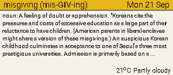 | 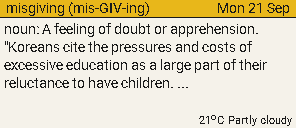 |
| `misgiving`, 874-char body (the real example is 855 chars) → the ladder picks **5pt** and the block ends with a visible `...` — but the block stopped at y=96 with the footer row at 115: **one whole line left unused** | definition + the usage's first sentence → the ladder picks **7pt**. Kept in the history as the size/coverage trade-off that was available when the fill-the-box behaviour was chosen |

| the same word, box grown to the footer row (7 lines) |
|---|
| 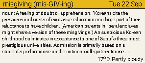 |
| Reported from the panel as "should allow for another line, as there is space": the box reserved a fixed 8px inset and stopped at y=104, not at the footer row. `kVerseMaxH` 82 → 93 (22 → 115) and `cc_lineCapacity = maxH / lineHeight` now hold **7 lines at 5pt**, ink ending at y=109 instead of 96 — the last line is `...collegiate entrance…` |

- **Space left unused under text** — the block reserved a fixed 8px inset for a line whose height
  depends on the font, so it dropped a 13px line at the 5pt rung while (at 10pt) it would have allowed
  a line to reach 11px *into* the footer row. The count is now derived from the line height and the
  box is defined by the two fixed rows. (LESSONS §68)

- **Same word as yesterday** — A.Word.A.Day publishes at 00:01 US Eastern, i.e. 14:01 AEST, *after*
  the 12:30 slot. The 12:30 refresh was reading yesterday's edition and showing it as today's word.
  Two changes: the word window now opens at **16:30** (`kCcWordOfDayStartMinutes`, after 15:00 was
  measured to be an hour short in the AEDT months), and the page's own
  edition date is compared with the device's local date, so a word that is not yet today's renders
  the verse instead of repeating. (LESSONS §67, §70)
- **No pronunciation** — the identity line degraded by dropping the respelling when it did not fit
  beside the date: 3 of the 18 most recent words, `soporiferous` among them. It now shrinks through
  7 → 6 → 5.5 → 5pt and truncates visibly only as a last resort. (LESSONS §65)
- **Incomplete usage example with space below** — the 855-char example was capped at 230 bytes by
  the parser and again by the body buffer, so the panel got ~272 chars cut mid-sentence; and because
  the shortened text then FIT, the block drew no overflow marker at all. The fields are 1024 bytes
  now (static BSS) and the renderer owns the cut, which it marks with `...`. (LESSONS §66)

The reuse: the same two bugs were reproducible offline in minutes with
`layout_render --word-file <saved page> --date-ymd <day>` — a *saved* page rather than the live one,
which is what makes a past day's defect renderable again.

---

## 9. The regression ledger — what is re-rendered on every run

These four are not history: they are the current required renders in `images/`, generated by the
default host build and byte-compared on every `verify_all.py` run. They are the fallback font
(5×7, no descenders) by construction, and they are the baseline every layout edit has to move
deliberately.

| the standard verse presentation | alert, bottom-pinned |
|---|---|
|  |  |

| no reading available | overflow marker |
|---|---|
|  | 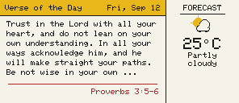 |

---

## The through-line

1. **Fewer presentations, bigger type.** Five layouts → one; then a sidebar → none. Each removal
   made the remaining thing better.
2. **The evidence moved from opinion to measurement.** "Looks fine" produced the 8pt FreeSans
   rejection and the ladder; `cc_verseFontSize()` reporting its own choice through the engine is
   what makes font decisions reviewable rather than arguable.
3. **Renders are only evidence when they are built like the device.** The date format diverged for
   a whole design review because one path was handed a literal (§54), and the ledger renders show
   the fallback font rather than the shipped one — which is why §1–§3's composition renders above
   are marked as the default-build captures they are.
4. **A display that lies is the worst failure mode.** The `0°C` fabrication and the canned verse
   (2026-09-13) were worse than any layout flaw, because they made a broken device look healthy.
